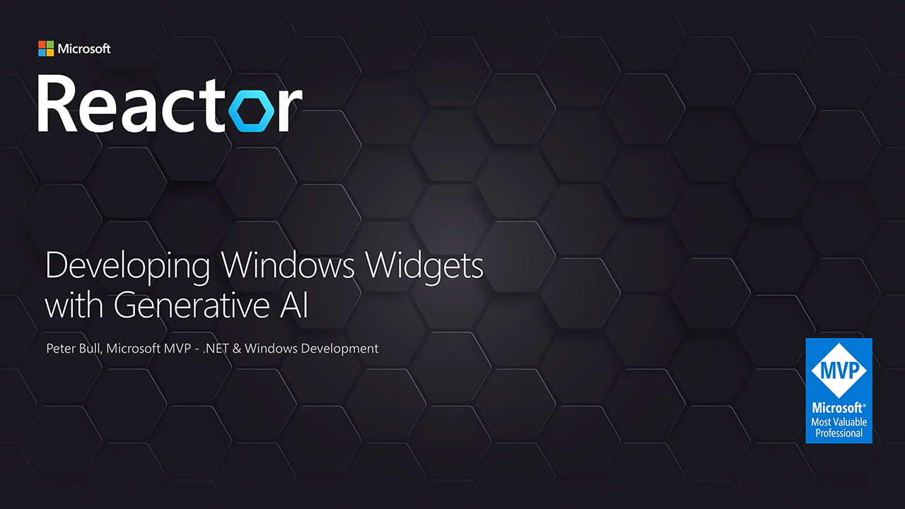

# Developing Windows Widgets with Generative AI

## Presentation

Here you can find Slides, Demo and Links for my presentation **Developing Windows Widgets with Generative AI**

## Links

* [comentsys.com](https://comentsys.com)
* [rogueplanetoid.com](https://rogueplanetoid.com)
* [tutorialr.com](https://tutorialr.com)
* [adaptivecards.io](https://adaptivecards.io)
* [aka.ms/winappsdk](https://aka.ms/winappsdk)
* [aka.ms/widgetdevdocs](https://aka.ms/widgetdevdocs)
* [comentsys.com/packages/toolkits](https://comentsys.com/packages/toolkits)
* [azure.net](https://azure.net)
* [github.com/marketplace/models](https://github.com/marketplace/models)
* [nuget.org/packages/Microsoft.Extensions.AI](https://www.nuget.org/packages/Microsoft.Extensions.AI)
* [nuget.org/packages/Microsoft.Extensions.AI.OpenAI](https://www.nuget.org/packages/Microsoft.Extensions.AI.OpenAI)
* [nuget.org/packages/Microsoft.Extensions.AI.Ollama](https://www.nuget.org/packages/Microsoft.Extensions.AI.Ollama)
* [nuget.org/packages/Microsoft.Extensions.AI.AzureAIInference](https://www.nuget.org/packages/Microsoft.Extensions.AI.AzureAIInference)
* [github.com/rogueplanetoid/developingwindowswidgets](https://github.com/rogueplanetoid/developingwindowswidgets)
* [github.com/rogueplanetoid/designingwindowswidgets](https://github.com/rogueplanetoid/designingwindowswidgets)
* [linkedin.com/in/rogueplanetoid](https://linkedin.com/in/rogueplanetoid)